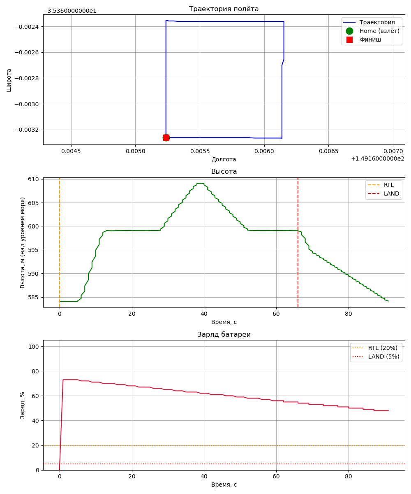

# Автономный полёт дрона с конечным автоматом на C++/ROS2 (учебный проект)

Контроллер дрона ArduPilot через ROS2 с использованием конечного автомата в однопоточном режиме (Single Thread Executor).

[](https://opensource.org/licenses/MIT)

---

## 🚀 Возможности

- **Телеметрия**: подписка на топики `/ap/geopose/filtered` и `/ap/battery`, получение координат в градусах и высоты в метрах над уровнем моря, уровня заряда батареи.
- **Управление**: через вызовы сервисов ArduPilot и публикацию сообщений:
  - Переключение в режим `GUIDED`, сервис `ap/mode_switch`, номер режима 4
  - Армирование (`ARM`) сервис `ap/arm_motors`
  - Взлёт (`TAKEOFF`), сервис `ap/experimental/takeoff`
  - Полёт по маршруту, сообщения `ardupilot_msgs::msg::GlobalPosition`, топик `/ap/cmd_gps_pose`
  - Переключение в режим посадки (`LAND`), сервис `ap/mode_switch`, номер режима 9.
- **Асинхронность**: все вызовы сервисов выполняются асинхронно, без блокировки основного потока.
- **Тестирование**: работает в симуляторе ArduPilot SITL.
- **Обработка внештатных ситуаций**: батарея, геозона, таймаут связи.
  - При снижении уровня заряда батареи до 20% переводим дрон в режим возврата на базу (`RTL`), сервис `ap/mode_switch`, номер режима 6.
  - При снижении уровня заряда батареи до 5% - в режим посадки (`LAND`), сервис `ap/mode_switch`, номер режима 9.
  - При удалении от точки взлёта на заданное расстояние переключаемся в режим возвращения (`RTL`), сервис `ap/mode_switch`, номер режима 6.
  - При отсутствии связи более заданного интервала времени (5 сек) логируем это состояние и переходим в режим ожидания. При восстановлении связи продолжаем выполнение полёта по маршруту.
- **Задание маршрута в файле**: все точки облёта задаются в файле `src/drone_controller_cpp/src/route.csv`. Координаты широты и долготы в градусах, высота в метрах от точки старта.
- **Логирование**: запись в `track.csv` во время полёта следующей информации: время с начала полёта в секундах, координаты и высота положения дрона, заряд аккумулятора, шаг конечного автомата, режим полётного контроллера.
- **Параметры командной строки**: при запуске узла можно задавать максимальное удаление от базы и критический заряд батареи.

---

## 🎬 Демонстрация

[Автономный полёт (3 мин)](./src/drone_controller_cpp/docs/video/flight_small.mp4)

---

## 🧠 Архитектура

### Конечный автомат (`State Machine`)

```text
    INIT,
    SET_GUIDED_MODE,
    WAIT_GUIDED_RESPONSE,
    SEND_ARMING,
    WAIT_ARMING_RESPONSE,
    SEND_TAKEOFF,
    WAIT_TAKEOFF_COMPLETE,
    FLY_TO_POINT,
    RETURN_TO_BASE,
    WAIT_RTL_RESPONSE,
    SEND_LANDING,
    WAIT_LANDING_RESPONSE,
    MISSION_COMPLETE,
    ERROR
```

**Каждый шаг:**

- Отправляет асинхронный запрос к сервисам ArduPilot или публикует сообщение.
- В колбэке обрабатывает ответ и переключает состояние.
- Таймер (500 мс) управляет переходами, не блокируя поток.

### Компоненты

| Компонент | Назначение |
|-----------|------------|
| Подписка | Обновляет положение дрона, заряд батареи, режим. Колбэк короткий и неблокирующий. |
| Таймер | Запускает `control_loop()` каждые 500 мс. Управляет миссией по шагам. |
| Клиенты ArduPilot | `mode_switch`, `arm_motors`, `takeoff` — асинхронные вызовы с колбэками. |

## 🛠 Стек

- **OS**: `Ubuntu 22.04 LTS`
- **ROS 2**: `Humble Hawksbill`
- **DDS**: `MicroXRCEAgent` (udp4, port 2019)
- **Симулятор**: `ArduPilot SITL`
- **Язык**: `C++17`
- **Сборка** (`CMake + colcon`):
```bash
cd ~/ardu_ws
colcon build --packages-select drone_controller_cpp
source install/setup.bash
```

## 📁 Структура пакета
```text
drone_controller_cpp/
├── src/
│   └── controller_node_params.cpp
├── missions/
│   └── route.csv
├── CMakeLists.txt
├── package.xml
├── README.md
└── CHANGELOG.md
```
## 🚀 Запуск

### 1️⃣ Симулятор SITL (терминал 1)
```bash
cd ~/ardu_ws/src/ardupilot
./Tools/autotest/sim_vehicle.py -v ArduCopter --console --map --enable-DDS
```
### 2️⃣ MicroXRCEAgent (терминал 2)
```bash
MicroXRCEAgent udp4 --port 2019
```
### 3️⃣ Узел управления (терминал 3)
```bash
cd ~/ardu_ws
source install/setup.bash
ros2 run drone_controller_cpp dds_machine
```
### 4️⃣ Запуск с параметрами (опционально)
Все настройки можно переопределить без перекомпиляции:
```bash
ros2 run drone_controller_cpp dds_machine --ros-args -p md:=200.0 -p lb:=30.0
```

## ⚙️ Параметры

| Параметр | Тип | По умолчанию | Назначение |
|----------|-----|--------------|------------|
| `md` | int | 1000 | Предельное удаление от home, м |
| `lb` | int | 20 | Порог срабатывания RTL, % |

### Файлы проекта
- Маршрут (смещения от home в градусах и метрах). Задаётся в `share/drone_controller_cpp/missions/route.csv`.
- Журнал полёта: `~/drone_logs/track.csv`.
  Создаётся автоматически при запуске узла.

| Файл | Расположение | Назначение |
|------|--------------|------------|
| `route.csv` | `share/drone_controller_cpp/missions/route.csv` | Маршрут: смещения от home в градусах (lat, lon) и метрах (alt). Копируется при сборке из `missions/` в исходниках. |
| `track.csv` | `~/drone_logs/track.csv` | Журнал полёта: секунда, координаты, высота, заряд, режим, шаг автомата. |

**Как найти установленный маршрут:**
```bash
ros2 pkg prefix drone_controller_cpp
# выведет: /home/guy/ardu_ws/install/drone_controller_cpp
# маршрут лежит в: <путь>/share/drone_controller_cpp/missions/route.csv
```

**Формат route.csv:**
```csv
lat,lon,alt
0.0,0.0,5.0
-0.0009,0.0,5.0
-0.0009,0.0009,5.0
0.0,0.0009,5.0
0.0,0.0,5.0
```

## 📊 Пример вывода
```text
guy@guy-home:~/ardu_ws$ ros2 run drone_controller_cpp dds_machine --ros-args -p lb:=90.0
[INFO] [1789559286.666171402] [minimal_controller]: Контроллер запущен в один поток.
[INFO] [1789559286.666292879] [minimal_controller]: Журнал полёта: /home/guy/drone_logs/track.csv
[INFO] [1789559287.166413147] [minimal_controller]: 0,-35.3632622,149.1652374,584.09,0.0,STABILIZE,INIT
[INFO] [1789559287.666419651] [minimal_controller]: Запрос режима GUIDED (4)...
[INFO] [1789559288.166437313] [minimal_controller]: Запрос на ARM...
[INFO] [1789559288.179677825] [minimal_controller]: Arm response: result=1
[INFO] [1789559288.666416569] [minimal_controller]: Запрос взлета на 15 метров...
[INFO] [1789559288.671789187] [minimal_controller]: Takeoff service response received: status=1
[INFO] [1789559291.166602544] [minimal_controller]: 4,-35.3632622,149.1652374,584.09,100.0,GUIDED,WAIT_TAKEOFF_COMPLETE
[INFO] [1789559295.166793054] [minimal_controller]: 8,-35.3632622,149.1652374,590.00,98.0,GUIDED,WAIT_TAKEOFF_COMPLETE
[INFO] [1789559299.166999717] [minimal_controller]: 12,-35.3632622,149.1652374,598.72,97.0,GUIDED,WAIT_TAKEOFF_COMPLETE
[INFO] [1789559299.667285003] [minimal_controller]: Целевая точка достигнута...
[INFO] [1789559303.167251128] [minimal_controller]: 16,-35.3631859,149.1652374,599.07,96.0,GUIDED,FLY_TO_POINT
[INFO] [1789559307.167470044] [minimal_controller]: 20,-35.3628616,149.1652374,599.09,95.0,GUIDED,FLY_TO_POINT
[INFO] [1789559311.167695391] [minimal_controller]: 24,-35.3624992,149.1652374,599.11,94.0,GUIDED,FLY_TO_POINT
[INFO] [1789559313.667864888] [minimal_controller]: Целевая точка достигнута...
[INFO] [1789559315.167920874] [minimal_controller]: 28,-35.3623543,149.1652527,599.41,93.0,GUIDED,FLY_TO_POINT
[INFO] [1789559319.168145439] [minimal_controller]: 32,-35.3623619,149.1655121,603.61,91.0,GUIDED,FLY_TO_POINT
[INFO] [1789559323.168418001] [minimal_controller]: 36,-35.3623619,149.1659546,607.48,90.0,GUIDED,FLY_TO_POINT
[INFO] [1789559325.168532971] [minimal_controller]: Запрос режима RTL (6)...
[INFO] [1789559327.168616163] [minimal_controller]: 40,-35.3623619,149.1661530,608.97,89.0,RTL,WAIT_RTL_RESPONSE
[INFO] [1789559331.168848685] [minimal_controller]: 44,-35.3624535,149.1660614,609.02,88.0,RTL,WAIT_RTL_RESPONSE
[INFO] [1789559335.169113531] [minimal_controller]: 48,-35.3627090,149.1658020,609.01,86.0,RTL,WAIT_RTL_RESPONSE
[INFO] [1789559339.169324459] [minimal_controller]: 52,-35.3629875,149.1655121,609.00,85.0,RTL,WAIT_RTL_RESPONSE
[INFO] [1789559343.169544380] [minimal_controller]: 56,-35.3632278,149.1652679,608.99,84.0,RTL,WAIT_RTL_RESPONSE
[INFO] [1789559347.169774852] [minimal_controller]: 60,-35.3632660,149.1652374,608.99,83.0,RTL,WAIT_RTL_RESPONSE
[INFO] [1789559351.170047845] [minimal_controller]: 64,-35.3632660,149.1652374,609.01,82.0,RTL,WAIT_RTL_RESPONSE
[INFO] [1789559355.170290654] [minimal_controller]: 68,-35.3632622,149.1652374,604.83,81.0,RTL,WAIT_RTL_RESPONSE
[INFO] [1789559359.170543242] [minimal_controller]: 72,-35.3632622,149.1652374,598.85,80.0,RTL,WAIT_RTL_RESPONSE
[INFO] [1789559363.170795214] [minimal_controller]: 76,-35.3632622,149.1652374,594.10,78.0,RTL,WAIT_RTL_RESPONSE
[INFO] [1789559367.171050059] [minimal_controller]: 80,-35.3632622,149.1652374,592.11,77.0,RTL,WAIT_RTL_RESPONSE
[INFO] [1789559371.171268876] [minimal_controller]: 84,-35.3632622,149.1652374,590.10,76.0,RTL,WAIT_RTL_RESPONSE
[INFO] [1789559375.171545130] [minimal_controller]: 88,-35.3632622,149.1652374,588.11,75.0,RTL,WAIT_RTL_RESPONSE
[INFO] [1789559379.171805734] [minimal_controller]: 92,-35.3632622,149.1652374,586.10,74.0,RTL,WAIT_RTL_RESPONSE
[INFO] [1789559383.172011713] [minimal_controller]: 96,-35.3632622,149.1652374,584.09,73.0,RTL,MISSION_COMPLETE
[INFO] [1789559383.172129485] [minimal_controller]: Миссия завершена успешно!

```
## 🧪 Пример использования

### После запуска всех компонентов узел:

- Подписывается на топики `/ap/geopose/filtered` и `/ap/battery` (телеметрия).
- Автоматически отправляет команды на взлёт, облёт по квадрату и посадку.
- Отслеживает состояние заряда батареи, удаление от базы, связь с узлом управления.
- Выводит информацию о ходе полёта.

При успешном запуске вы увидите в консоли сообщения о взлёте, местоположении и посадке, а также перемещение дрона на карте.

### Обработка ошибок
- При снижении уровня заряда батареи до 20% выводится сообщение о возврате на базу, при снижении уровня заряда до 5% о переходе в режим посадки.
- При удалении от точки взлёта на заданное расстояние также переключаемся в режим возвращения.
- При отсутствии связи более 5 сек логируем это состояние и переходим в режим ожидания. При восстановлении связи продолжаем выполнение полёта по маршруту.

## 📈 Анализ полёта
После завершения миссии журнал полёта можно превратить в графики.

### Установка зависимостей
```bash
sudo apt install python3-pandas python3-matplotlib
```
### Запуск скрипта анализа полёта
```bash
ros2 run drone_controller plot_log ~/drone_logs/track.csv
```
Скрипт создаёт PNG с тремя графиками:
- Траектория полёта — в координатах (долгота, широта). Отмечены home и точка финиша.
- Высота от времени — вертикальные линии в моменты перехода в режимы RTL и LAND.
- Заряд батареи от времени — горизонтальные линии порогов 20% (RTL) и 5% (LAND).

### Пример


## 📌 Планы по развитию

- [x] Полёт по точкам (waypoints)

- [x] Посадка (LAND)

- [x] Обработка ошибок (таймауты, аварийная посадка при ошибке)

- [x] Обработка аварий (заряд аккумулятора, вылет за периметр)

- [x] Логирование телеметрии в CSV

- [x] Задание маршрутной карты в файле route.csv

- [x] Обработать лог файл, построить траекторию, высоту, заряд

- [x] Вынести параметры миссии в ROS-параметры

- [x] Видео полёта — записать экран с MAVProxy map

## [История изменений](CHANGELOG.md)

## 📚 Источники

[ArduPilot SITL](https://ardupilot.org/dev/docs/setting-up-sitl-on-linux.html)

[ROS 2 Humble](https://docs.ros.org/en/humble/)


## 📬 Контакты

Автор: [ituretsky]  
GitHub: [ituretsky](https://github.com/ituretsky)
